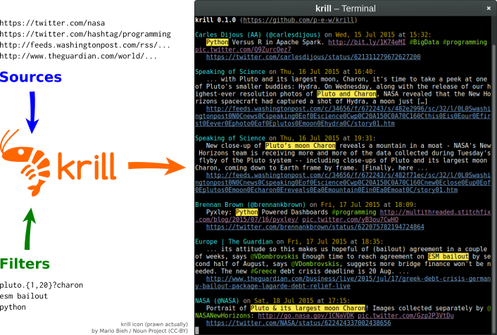

[](https://pypi.python.org/pypi/krill)  


# Want news? Just `krill` it!

[Krill](https://en.wikipedia.org/wiki/Krill) are [*filter feeders*](https://en.wikipedia.org/wiki/Filter_feeder). True to its namesake, `krill` :fried_shrimp: filters feeds. It is not picky about its diet, and will happily consume **RSS, Atom, CDF** and even **Twitter** :bird: feeds (*no credentials required!*). It aggregates feed items from all sources you specify, filters out those that interest you, and displays them as a **live stream** :fire: of clean, legible command line output.



`krill` is beautifully minimal. `krill` is extremely easy to set up and use, and runs anywhere Python runs. `krill` is a refreshingly different way of consuming news :newspaper: and updates from anywhere on the web. **`krill` is the hacker's way of keeping up with the world.** :globe_with_meridians:


## Installation

`krill` requires [Python](https://www.python.org/) 2.7+/3.2+ :snake:. If you have the [pip](https://pip.pypa.io) package manager, all you need to do is run

```
pip install krill
```

either as a superuser or from a [virtualenv](https://virtualenv.pypa.io) environment.

Of course, you can also [download the script](krill/krill.py) directly from this repository, in which case you will need to install the dependencies [Beautiful Soup](http://www.crummy.com/software/BeautifulSoup/) (*what a library!* :star:), [feedparser](https://github.com/kurtmckee/feedparser) and [blessings](https://github.com/erikrose/blessings) manually.


## Usage

### Command line

```
krill [-h] [-s URL [URL ...]] [-S FILE] [-f REGEX [REGEX ...]]
      [-F FILE] [-u SECONDS]

  -s URL [URL ...], --sources URL [URL ...]
                        URLs to pull data from
  -S FILE, --sources-file FILE
                        file from which to load source URLs (OPML format
                        assumed if filename ends with ".opml")
  -f REGEX [REGEX ...], --filters REGEX [REGEX ...]
                        patterns used to select feed items to print
  -F FILE, --filters-file FILE
                        file from which to load filter patterns
  -u SECONDS, --update-interval SECONDS
                        time between successive feed updates (default: 300
                        seconds, 0 for single pull only)
```

### Example

```
krill -s "https://twitter.com/nasa" -f "new ?horizons"
```

will follow NASA's :rocket: Twitter stream, printing only tweets that mention the [*New Horizons* probe](https://en.wikipedia.org/wiki/New_Horizons).

`krill` automatically determines whether to treat a web document as a Twitter or an XML feed. If multiple sources and/or filters are loaded from a file with the `-S` and `-F` tags, each must be on a separate line (except if the sources file uses the [OPML](https://en.wikipedia.org/wiki/OPML) format, in which case all `xmlUrl` attributes are loaded). Empty lines and lines starting with `#` (comments) are ignored.

Inline and file specifications may be combined freely. If more than one filter is given, items matching *any* of the filters are printed. If no filter is given, all items are printed.


## License

Copyright &copy; 2015 Philipp Emanuel Weidmann (<pew@worldwidemann.com>)

Released under the terms of the [GNU General Public License, version 3](https://gnu.org/licenses/gpl.html)
